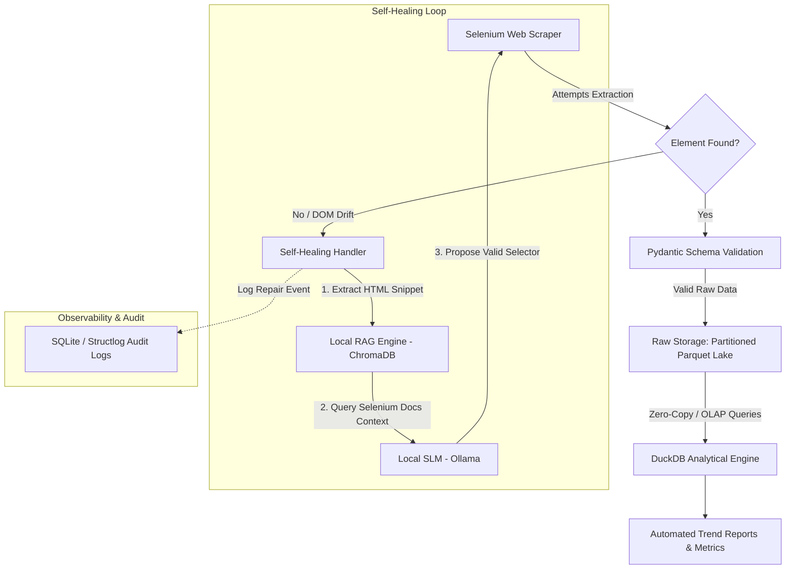

# 🔄 Project Boucle: Self-Healing Scraper & Adaptive ETL Pipeline

An enterprise-grade, resilient web scraping and ETL pipeline designed to automatically detect DOM/schema drift and auto-heal selectors using a local Small Language Model (SLM) grounded in official Selenium documentation, with immutable Parquet cold storage and DuckDB OLAP analytics.

---

## 🎯 The Problem & The Solution

- **The Problem:** Traditional Web Scrapers break whenever target websites update their DOM structure, class names, or layout—requiring manual maintenance and disrupting downstream data pipelines.
- **The Solution:** *Project Boucle* introduces a **Self-Healing Loop**. When a selector fails (`NoSuchElementException`), the pipeline captures the HTML context, queries a local vector store containing Selenium documentation (RAG), and uses a lightweight SLM (Qwen2.5-Coder / Phi-3 via Ollama) to generate a valid, compliant selector on the fly.
- **Storage Strategy:** Scraped data is saved as immutable **Parquet** files (Raw Cold Lake), while **DuckDB** queries these files directly to build aggregated trend reports without running heavy database infrastructure.

---

## 🏗️ Architecture

Vibe coded with love by a slacker in his underwear
