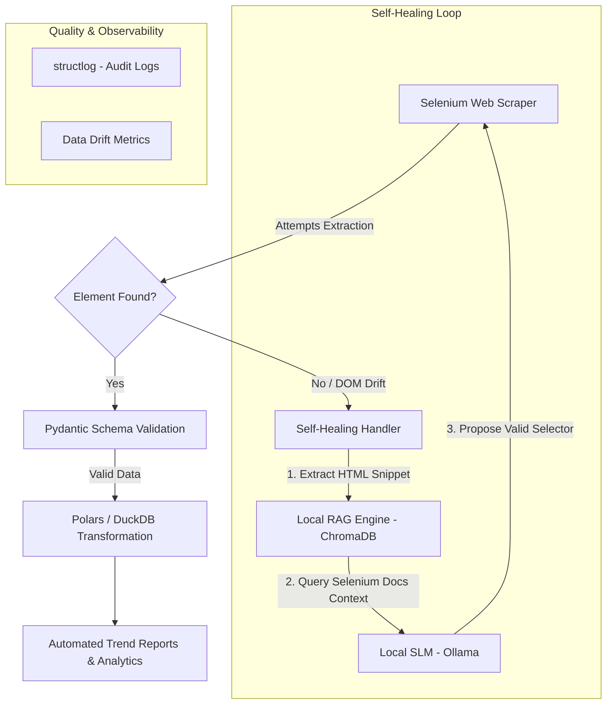

Voici un template de `README.md` rédigé en anglais (indispensable pour le marché britannique) et taillé sur mesure pour impressionner un client ou un Tech Lead.

Il met immédiatement en avant le problème business (la fragilité des scrapers), ta solution technique innovante (SLM local + RAG), et la rigueur de ton engineering (Polars, DuckDB, Pydantic, CI/CD).

---

### Proposition de `README.md` à copier-coller

```markdown
# 🔄 Project Boucle: Self-Healing Scraper & Adaptive ETL Pipeline


An enterprise-grade, resilient web scraping and ETL pipeline designed to automatically detect DOM/schema drift and auto-heal selectors using a local Small Language Model (SLM) grounded in official Selenium documentation.

---

## 🎯 The Problem & The Solution

- **The Problem:** Traditional Web Scrapers break whenever target websites update their DOM structure, class names, or layout—requiring manual maintenance and disrupting downstream data pipelines.
- **The Solution:** *Project Boucle* introduces a **Self-Healing Loop**. When a selector fails (`NoSuchElementException`), the pipeline captures the HTML context, queries a local vector store containing Selenium documentation (RAG), and uses a lightweight SLM (Qwen2.5-Coder / Phi-3 via Ollama) to generate a valid, compliant selector on the fly.

---

## 🏗️ Architecture



---

## ✨ Key Features

* 🛡️ **Self-Healing Automation:** Automatically recovers from broken CSS/XPath selectors without pipeline failure.
* 🔒 **Bounded SLM (Zero Hallucinations):** RAG restricts model responses strictly to official Selenium APIs and robust selector patterns.
* ⚡ **Local & Cost-Effective:** Powered by local SLMs via Ollama—zero external API costs or data privacy concerns.
* 📊 **High-Performance ETL:** Fast data ingestion and aggregation using Polars and DuckDB.
* 📐 **Strict Data Contracts:** Input/output validation enforced via Pydantic schemas.
* 🪵 **Production Observability:** Structured JSON logging tracking repair events and extraction lineage.

---

## 🛠️ Tech Stack

* **Language:** Python 3.11+
* **Scraping:** Selenium / WebDriver
* **AI / RAG:** Ollama (Qwen2.5-Coder / Phi-3), ChromaDB / LanceDB, LangChain / LlamaIndex
* **ETL & Analytics:** Polars, DuckDB, Pydantic
* **Code Quality & Testing:** Ruff, MyPy, Pytest, Docker

---

## 🚀 Quickstart

### Prerequisites

* Python 3.11+
* [Poetry](https://python-poetry.org/) (or `uv` / `pip`)
* [Ollama](https://ollama.ai/) running locally with your chosen model:
```bash
ollama pull qwen2.5-coder:3b

```


### Installation

1. **Clone the repository:**
```bash
git clone [https://github.com/BTBMortier/project-boucle.git](https://github.com/BTBMortier/project-boucle.git)
cd project-boucle

```


2. **Set up virtual environment & install dependencies:**
```bash
poetry install

```


3. **Run the ETL & Scraper Pipeline:**
```bash
poetry run python -m src.main

```


---

## 🧪 Testing & Quality Assurance

Run unit tests and self-healing simulation suites:

```bash
# Run tests
poetry run pytest

# Check formatting and typing
poetry run ruff check .
poetry run mypy src/

```

---

## 👤 Author

**BTBMortier**

*Freelance Data & AI Engineer*

* [GitHub](https://www.google.com/search?q=https://github.com/BTBMortier)
* [LinkedIn](https://linkedin.com/in/your-profile)
