# 🔁 Project Boucle

[](#)
[](#)
[](#)
[](#)

## 📌 Présentation

**Project Boucle** est un pipeline ETL (Extract, Transform, Load) automatisé et résilient, conçu pour l'ingestion massive de flux textuels non structurés issus du web. 

Le système orchestre l'extraction automatisée des contenus, leur nettoyage/normalisation distribuée via Spark, et leur stockage hybride (Relationnel & Document) pour des besoins d'analyse à grande échelle.

L'ensemble de l'architecture est conteneurisé et orchestré via **Apache Airflow**, tout en restant exécutable en mode CLI autonome.

---

## 📐 Architecture & Infrastructure

Le pipeline suit un modèle séquentiel strict piloté par DAG, garantissant l'intégrité des données à chaque étape de transformation :

```mermaid
graph LR
    WEB[🌐 Forums Web] -->|Scrapy| INGEST[1. Scrapy Spiders<br/><i>topics & posts</i>]
    INGEST -->|Dump| RAW[(📄 Raw JL Buffer)]
    RAW -->|PySpark| SPARK[2. Data Transformation<br/><i>tl_topics & tl_posts</i>]
    
    SPARK -->|Persist SQL| PG[(🐘 PostgreSQL<br/>Data Structurée)]
    SPARK -->|Archive NoSQL| MONGO[(🍃 MongoDB<br/>Archivage Document)]

    subgraph AIRFLOW [⚙️ Orchestration : Apache Airflow DAG]
        INGEST
        RAW
        SPARK
    end

    classDef storage fill:#2b2b2b,stroke:#888,stroke-width:1px;
    class PG,MONGO,RAW storage;
```



---

## 🛠️ Stack Technique

* **Scraping & Parsing :** Scrapy (Spiders asynchrones multi-threads)
* **Processing & ETL :** Python, Apache Spark / PySpark
* **Bases de Données :** PostgreSQL (Données relationnelles), MongoDB (Archivage JSON)
* **Orchestration :** Apache Airflow (DAGs orientés événements/planning)
* **Environnement :** Docker, Bash


## Arborescence du Projet

```text
.
├── Dockerfile
├── requirements.txt
├── README.md
└── pipeline/
    ├── scrapy.cfg
    ├── boucled_scrapers/             # Projets et spiders Scrapy
    │   ├── items.py
    │   ├── middlewares.py
    │   ├── pipelines.py
    │   ├── settings.py
    │   └── spiders/
    │       ├── topics.py             # Spider d'extraction des sujets
    │       ├── posts.py              # Spider d'extraction des posts
    │       ├── long_posts.py
    │       ├── long_topics.jl
    │       └── launch_spiders.sh
    ├── boucled_etl/                  # Scripts de transformation et chargement
    │   ├── tl_topics.py              # Traitement des sujets
    │   ├── tl_posts.py               # Traitement des messages
    │   ├── tl_topics.ipynb
    │   ├── tl_posts.ipynb
    │   └── convert_nbs.sh            # Conversion des notebooks en scripts Python
    ├── boucled_db/                   # Interactions avec les bases de données
    │   ├── postgres.py               # Gestion du stockage PostgreSQL
    │   ├── mongodb.py                # Gestion du stockage MongoDB
    │   └── change_psql_password.sh
    └── dags/                         # Orchestration Airflow
        └── forum_etl.py              # DAG de planification du pipeline

```

---

## Flux d'Exécution (DAG Airflow)

Le DAG `forum_etl` planifie l'exécution séquentielle des étapes suivantes :

1. **`scrape_topics` :** Lancement du spider Scrapy `topics` pour exporter les données brutes dans `topics.jl`.
2. **`scrape_posts` :** Exécution du spider `posts` à la suite de la récupération des sujets.
3. **`transload_posts` :** Nettoyage, transformation et chargement des messages via `tl_posts.py`.
4. **`transload_topics` :** Transformation et persistance finale des sujets via `tl_topics.py`.

---

## Installation et Déploiement

### Option 1 : Déploiement Conteneurisé (Docker)

1. Construire l'image Docker :
```bash
docker build -t project-boucle .

```


2. Exécuter le conteneur :
```bash
docker run -d --name project-boucle-container project-boucle

```


### Option 2 : Exécution Locale / Autonome

1. Cloner le dépôt :
```bash
git clone https://github.com/BTBMortier/project-boucle.git
cd project-boucle

```


2. Installer les dépendances Python :
```bash
pip install -r requirements.txt

```


3. Exécuter manuellement les composants du pipeline :
```bash
# 1. Extraction
cd pipeline/boucled_scrapers/spiders
scrapy crawl topics -O topics.jl
scrapy crawl posts

# 2. Transformation et chargement
python3 ../../boucled_etl/tl_posts.py
python3 ../../boucled_etl/tl_topics.py

```


---

## Conversion des Notebooks

Les fichiers de prototypage `.ipynb` situés dans `pipeline/boucled_etl/` peuvent être convertis en scripts Python exécutables via le script utilitaire fourni :

```bash
bash pipeline/boucled_etl/convert_nbs.sh

```
